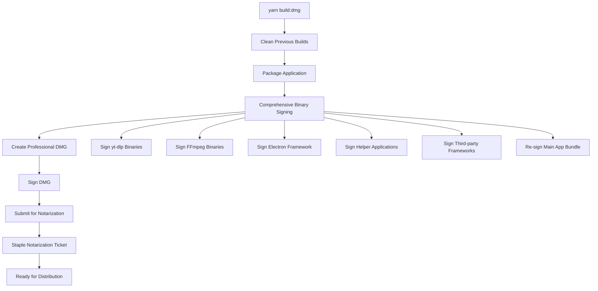

# Enhanced macOS Build System

## Overview

This enhanced build system provides a complete solution for building, signing, notarizing, and distributing Downlodr for macOS. It replaces the previous build process with a more reliable, secure, and professional workflow.

## 🚀 Quick Start

```bash
# 1. Setup environment (one-time)
cp env.example .env
# Edit .env with your Apple Developer credentials

# 2. Install dependencies
brew install create-dmg
yarn install

# 3. Build for distribution
yarn build:dmg
```

## 📁 Documentation

| Document | Purpose |
|----------|---------|
| [`docs/MACOS_BUILD_DISTRIBUTION.md`](docs/MACOS_BUILD_DISTRIBUTION.md) | Complete build system documentation |
| [`docs/TROUBLESHOOTING_MACOS.md`](docs/TROUBLESHOOTING_MACOS.md) | Solutions to common build/distribution issues |
| [`docs/USER_INSTALLATION_GUIDE.md`](docs/USER_INSTALLATION_GUIDE.md) | User-friendly installation guide |

## 🛠️ Available Scripts

### NPM Scripts
```bash
yarn build:dmg        # Full production build with notarization (ARM64)
yarn build:intel      # Full production build with notarization (Intel x64)
yarn test:dmg         # Test DMG creation without notarization  
yarn build:quick      # Original build process (fallback)
yarn package          # Package app only
yarn make             # Package + create installers
```

### Build Scripts
```bash
./scripts/build-with-create-dmg.sh         # Enhanced build with create-dmg (ARM64)
./scripts/build-with-create-dmg-intel.sh   # Enhanced build with create-dmg (Intel x64)
./scripts/test-create-dmg.sh               # Test DMG creation
./scripts/fix-binary-signing.sh            # Fix binary signing issues
./scripts/diagnose-distribution-issues.sh  # Comprehensive diagnostics
```

## 🎯 Key Improvements

### ✅ Resolved Issues
- **No more "Move to Trash" warnings** - Proper DMG notarization
- **No password prompts** - Correct binary signing and entitlements  
- **Working video downloads** - Properly signed FFmpeg and yt-dlp binaries
- **Professional installers** - Beautiful DMG with create-dmg
- **Reliable distribution** - Comprehensive security validation
- **Multi-architecture support** - Separate builds for ARM64 and Intel x64

### 🔧 Technical Enhancements
- **Automated environment loading** - No manual sourcing required
- **Clean DMG creation** - Only app bundle, no loose files
- **Comprehensive binary signing** - All components properly signed
- **Enhanced error handling** - Better error messages and recovery
- **Built-in diagnostics** - Automated issue detection

## 🏗️ Architecture Support

### Multi-Architecture Builds
The build system supports both Mac architectures:

#### **ARM64 (Apple Silicon)**
```bash
yarn build:dmg                    # Build for ARM64 Macs (M1, M2, M3, M4)
./scripts/build-with-create-dmg.sh
```
- **Output**: `Downlodr-{version}-{timestamp}.dmg`
- **Target**: Apple Silicon Macs (M1/M2/M3/M4)
- **Optimized**: Native ARM64 performance

#### **Intel x64 (Intel Macs)**
```bash
yarn build:intel                  # Build for Intel x64 Macs
./scripts/build-with-create-dmg-intel.sh
```
- **Output**: `Downlodr-{version}-intel-x64-{timestamp}.dmg`
- **Target**: Intel-based Mac machines
- **Cross-compilation**: Can build from ARM64 or Intel hosts

### Architecture Detection
Both scripts automatically:
- ✅ Detect host architecture and warn about cross-compilation
- ✅ Verify target architecture in final app bundle
- ✅ Include architecture info in DMG naming
- ✅ Validate binary compatibility

## 🎨 DMG Features

### Professional Design
Our DMG creation system produces professional-looking installers with Fellou-style layouts. See [DMG Design Guide](docs/DMG_DESIGN_GUIDE.md) for complete configuration details.

**Visual Features:**
- Custom volume names and icons
- Drag-drop layout with Applications folder
- Professional window sizing (660x400)
- Background images and custom positioning
- Large, clear app icons (128px)

**Permission Handling:**
- Automatic fallback if `create-dmg` lacks permissions
- Functional DMGs created even without Full Disk Access
- Optional: Grant Terminal "Full Disk Access" for full styling

The enhanced build system creates professional DMGs with:
- Custom app icon and volume name
- Drag & drop to Applications folder
- Professional window layout (800x550)
- Clean, minimalist design
- Proper code signing and notarization
- Architecture-specific volume naming

## 🔒 Security Features

### Code Signing
- All binaries signed with Apple Developer ID
- Hardened runtime enabled
- Secure timestamp included
- Production entitlements used

### Notarization
- Complete app bundle notarized
- DMG itself signed and notarized
- Notarization ticket stapled
- Gatekeeper approved

### Binary Security
- yt-dlp signed with network entitlements
- FFmpeg signed with execution entitlements
- All Electron Framework components signed
- Third-party frameworks properly signed

## 📊 Build Process Flow



## 🧪 Testing and Validation

### Automated Diagnostics
```bash
# Run comprehensive diagnostic
./scripts/diagnose-distribution-issues.sh

# Checks:
# ✅ Code signature validity
# ✅ Notarization status
# ✅ Binary functionality  
# ✅ Security compliance
# ✅ Common configuration issues
```

### Manual Validation
```bash
# Verify DMG security
spctl --assess --verbose --type install out/make/Downlodr-*.dmg

# Expected output:
# accepted
# source=Notarized Developer ID
```

## 🔧 Environment Setup

### Required Tools
```bash
# Install build dependencies
brew install create-dmg

# Verify installation
create-dmg --version
```

### Apple Developer Setup
1. **Apple Developer Program** membership
2. **Developer ID Application** certificate installed
3. **App-specific password** generated
4. Environment variables configured in `.env`

### Configuration File
```bash
# .env file contents
APPLE_IDENTITY="Developer ID Application: Your Name (TEAM123456)"
APPLE_ID="your-apple-id@example.com"
APPLE_APP_SPECIFIC_PASSWORD="abcd-efgh-ijkl-mnop"
APPLE_TEAM_ID="TEAM123456"
NODE_ENV="production"
```

## 🚨 Troubleshooting

### Quick Fixes

| Issue | Quick Fix |
|-------|-----------|
| "Move to Trash" warning | `yarn build:dmg` |
| Password prompts | Check entitlements, re-sign binaries |
| Videos won't play | `./scripts/fix-binary-signing.sh` |
| Build fails | Clear cache, `yarn install`, retry |

### Comprehensive Diagnostics
```bash
# Get detailed issue analysis
./scripts/diagnose-distribution-issues.sh

# Shows:
# - Security warnings analysis
# - Password prompt causes
# - Video playback issues
# - Specific recommendations
```

## 📝 Migration from Old Build System

### Differences from Previous System
| Aspect | Old System | New System |
|--------|------------|------------|
| DMG Creation | hdiutil | create-dmg |
| Security | Basic signing | Comprehensive signing |
| Notarization | App only | App + DMG |
| Error Handling | Limited | Comprehensive |
| Diagnostics | Manual | Automated |

### Migration Steps
1. Update environment with new variables
2. Install create-dmg dependency
3. Use new build commands
4. Test with diagnostic tools

## 🎉 Success Metrics

### Before Enhancement
- ❌ "Move to Trash" security warnings
- ❌ Password prompts during app launch
- ❌ Video playback failures
- ❌ Manual troubleshooting required
- ❌ Inconsistent distribution results

### After Enhancement  
- ✅ Seamless installation experience
- ✅ No security warnings or password prompts
- ✅ Fully functional video downloads
- ✅ Automated issue detection and resolution
- ✅ Professional, reliable distribution

## 🤝 Contributing

### Reporting Issues
When reporting build issues, include:
- Output from `./scripts/diagnose-distribution-issues.sh`
- macOS and Xcode versions
- Complete error messages
- Steps to reproduce

### Improving the Build System
1. Test changes with `yarn test:dmg`
2. Validate with diagnostic script
3. Update documentation
4. Submit pull request

## 📚 Additional Resources

### Apple Documentation
- [Code Signing Guide](https://developer.apple.com/library/archive/documentation/Security/Conceptual/CodeSigningGuide/)
- [Notarization Documentation](https://developer.apple.com/documentation/security/notarizing_macos_software_before_distribution)
- [App Distribution Guide](https://help.apple.com/xcode/mac/current/#/dev8b4250b57)

### Third-Party Tools
- [create-dmg GitHub](https://github.com/create-dmg/create-dmg)
- [Electron Forge Documentation](https://www.electronforge.io/)
- [Electron Security Guide](https://www.electronjs.org/docs/tutorial/security)

---

**Build System Version**: 2.0  
**Last Updated**: August 13, 2025  
**Compatibility**: Downlodr v1.7.2+  
**Tested On**: macOS Sonoma 14.0, macOS Sequoia 15.0
