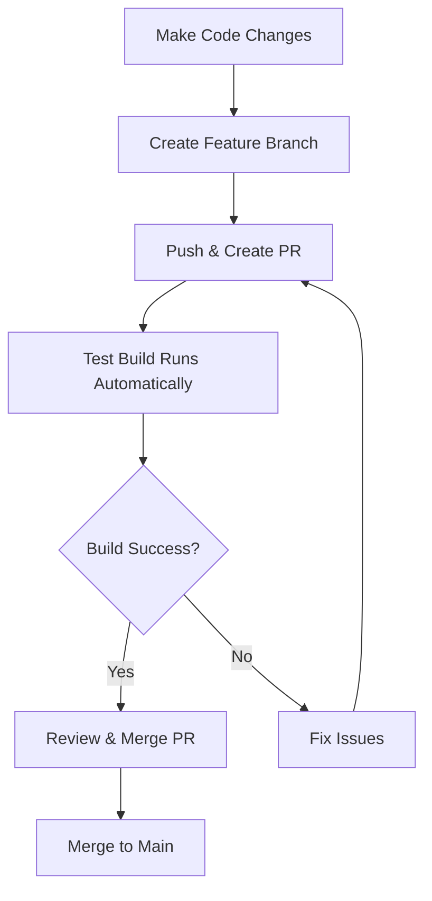
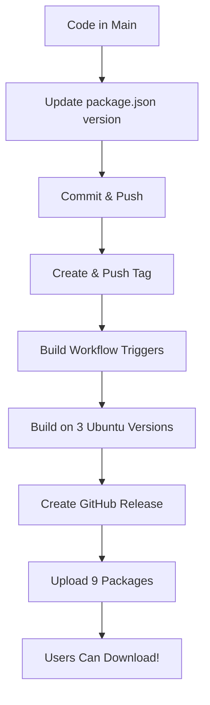

# 🚀 GitHub Actions Setup Complete!

Your Downlodr project now has **fully automated Linux builds** that publish to GitHub Releases! 

## ✅ What Was Configured

### 1️⃣ Production Build Workflow
**File:** `.github/workflows/build-linux.yml`

Automatically builds Linux packages when you push version tags:
- ✅ Builds for **Ubuntu 20.04, 22.04, and 24.04**
- ✅ Creates **9 packages** per release (DEB, RPM, ZIP × 3 versions)
- ✅ Publishes to **GitHub Releases** automatically
- ✅ Generates **comprehensive release notes**
- ✅ Supports **manual triggering** via GitHub UI

### 2️⃣ Test Build Workflow  
**File:** `.github/workflows/test-build-linux.yml`

Tests builds on pull requests before merging:
- ✅ Validates build process on PRs
- ✅ Posts build results as PR comments
- ✅ Runs linting and verification
- ✅ Stores test artifacts for 3 days
- ✅ No release creation (safe for testing)

### 3️⃣ Complete Documentation
**Files:** `.github/workflows/README.md`, `.github/RELEASE_GUIDE.md`, `.github/SETUP_COMPLETE.md`

Comprehensive guides for:
- Creating releases
- Troubleshooting
- Best practices
- Configuration details

### 4️⃣ Test Script
**File:** `.github/test-release.sh`

Interactive script to test the setup:
```bash
./.github/test-release.sh
```

## 🎯 Quick Start - Create Your First Release

### Option 1: Automatic (Recommended)

```bash
# 1. Update version (if needed)
vim package.json  # Change version to 1.7.8

# 2. Commit changes
git add package.json
git commit -m "chore: bump version to 1.7.8"
git push origin main

# 3. Create and push tag (triggers build automatically!)
git tag -a v1.7.8-stable -m "Release v1.7.8 stable"
git push origin v1.7.8-stable

# 4. Done! Monitor at:
# https://github.com/[your-username]/Downlodr/actions
```

### Option 2: Test First (Recommended for First Time)

```bash
# Run the interactive test script
./.github/test-release.sh

# Follow the prompts to:
# - Create a test tag
# - Trigger the build
# - Get monitoring links
# - Learn how to clean up
```

## 📦 What Gets Published

Each release automatically includes **9 packages**:

```
Ubuntu 20.04:
├── downlodr_1.7.8_amd64-Ubuntu-20.04.deb
├── downlodr-1.7.8.x86_64-Ubuntu-20.04.rpm
└── downlodr-linux-x64-1.7.8-Ubuntu-20.04.zip

Ubuntu 22.04:
├── downlodr_1.7.8_amd64-Ubuntu-22.04.deb
├── downlodr-1.7.8.x86_64-Ubuntu-22.04.rpm
└── downlodr-linux-x64-1.7.8-Ubuntu-22.04.zip

Ubuntu 24.04:
├── downlodr_1.7.8_amd64-Ubuntu-24.04.deb
├── downlodr-1.7.8.x86_64-Ubuntu-24.04.rpm
└── downlodr-linux-x64-1.7.8-Ubuntu-24.04.zip
```

## ⏱️ Build Timeline

```
Tag Push → Build Start (automatic)
    ↓
Ubuntu 20.04 Build (~10-15 min) ┐
Ubuntu 22.04 Build (~10-15 min) ├─ In Parallel
Ubuntu 24.04 Build (~10-15 min) ┘
    ↓
Artifact Collection (~1 min)
    ↓
Release Creation (~1 min)
    ↓
🎉 Release Published! (~15-30 min total)
```

## 🏷️ Tag Naming Guide

The workflow automatically detects release types:

| Tag | Type | GitHub Status | Example |
|-----|------|---------------|---------|
| `v1.7.8` or `v1.7.8-stable` | Stable Release | ✅ Release | Production ready |
| `v1.8.0-beta` | Beta | ⚠️ Pre-release | Testing phase |
| `v1.8.0-alpha` | Alpha | ⚠️ Pre-release | Early testing |
| `v1.8.0-rc1` | Release Candidate | ⚠️ Pre-release | Final testing |
| `v1.7.10-exp` | Experimental | ⚠️ Pre-release | Experimental build |

## 📚 Documentation Quick Reference

| I want to... | Read this... |
|-------------|--------------|
| **Create a release** | [.github/RELEASE_GUIDE.md](.github/RELEASE_GUIDE.md) |
| **Understand the setup** | [.github/SETUP_COMPLETE.md](.github/SETUP_COMPLETE.md) |
| **Learn workflow details** | [.github/workflows/README.md](.github/workflows/README.md) |
| **See all files created** | [.github/FILES_CREATED.md](.github/FILES_CREATED.md) |
| **Test the setup** | Run `.github/test-release.sh` |

## 🔧 No Additional Configuration Needed!

The workflows use:
- ✅ Default `GITHUB_TOKEN` (automatically provided by GitHub)
- ✅ Your existing `scripts/build-linux.sh`
- ✅ Your existing `package.json` configuration
- ✅ Standard GitHub Actions permissions

**Nothing else to set up!** Just push a tag and it works! 🎉

## 🎓 Complete Workflow

### Development Flow



### Release Flow



## 🎯 Next Steps

### 1. Verify Setup ✅
```bash
# Check all files exist
ls -la .github/workflows/
ls -la .github/*.md
ls -la .github/test-release.sh
```

### 2. Test the Setup 🧪
```bash
# Run interactive test
./.github/test-release.sh

# Or manually create test tag
git tag v1.7.7-test
git push origin v1.7.7-test
```

### 3. Monitor Build 👀
- Go to: `https://github.com/[username]/Downlodr/actions`
- Watch the workflow run
- Check build logs
- Wait ~15-30 minutes

### 4. Verify Release 📦
- Go to: `https://github.com/[username]/Downlodr/releases`
- Check all 9 packages uploaded
- Test download links
- Read release notes

### 5. Create Production Release 🚀
```bash
# Update version
vim package.json

# Commit
git add package.json
git commit -m "chore: bump version to 1.7.8"
git push origin main

# Tag and release!
git tag -a v1.7.8-stable -m "Release v1.7.8 stable"
git push origin v1.7.8-stable
```

## 💡 Pro Tips

### 1. Add Build Badge to README
```markdown

```

### 2. Test Before Releasing
Always create a PR first to trigger test builds:
```bash
git checkout -b feature/my-feature
# make changes
git push origin feature/my-feature
# Create PR - test build runs automatically
```

### 3. Enable Notifications
- Go to GitHub Settings → Notifications
- Enable "Actions" notifications
- Get notified when builds complete

### 4. Use Semantic Versioning
- `MAJOR.MINOR.PATCH` (e.g., `1.7.8`)
- Increment MAJOR for breaking changes
- Increment MINOR for new features
- Increment PATCH for bug fixes

## 🐛 Troubleshooting

### Build Fails?
1. Check workflow logs in Actions tab
2. Look for red ❌ marks
3. Click to see detailed error
4. Common issues:
   - Binary download timeout → Retry
   - Dependency issue → Check OS-specific logs
   - Syntax error → Validate YAML

### Release Already Exists?
```bash
# Delete tag and recreate
git tag -d v1.7.8
git push origin :refs/tags/v1.7.8
git tag -a v1.7.8-stable -m "Release v1.7.8"
git push origin v1.7.8-stable
```

### No Artifacts?
- Check `scripts/build-linux.sh` logs
- Verify `yarn make --platform=linux` succeeds
- Check `out/` directory structure

## 📊 Monitoring Your Builds

### Actions Tab
View all workflow runs:
```
https://github.com/[username]/Downlodr/actions
```

### Releases Page
View all published releases:
```
https://github.com/[username]/Downlodr/releases
```

### Latest Release
Direct link to latest:
```
https://github.com/[username]/Downlodr/releases/latest
```

## 🎉 Success Criteria

You'll know everything is working when:

- ✅ Workflows appear in Actions tab
- ✅ Tag push triggers build automatically
- ✅ Build completes in ~15-30 minutes
- ✅ Release appears on Releases page
- ✅ All 9 packages are uploaded
- ✅ Release notes are generated
- ✅ Download links work
- ✅ Packages install on target OS

## 🔮 Future Enhancements

Consider adding later:

- [ ] **AppImage** builds for universal compatibility
- [ ] **ARM64** architecture support
- [ ] **Code signing** for verified packages
- [ ] **Flatpak/Snap** packages
- [ ] **Automated changelog** generation
- [ ] **Integration tests** before release
- [ ] **Update server** for in-app updates
- [ ] **macOS builds** workflow

## 📞 Getting Help

If you need assistance:

1. **Read the docs** - Start with [RELEASE_GUIDE.md](.github/RELEASE_GUIDE.md)
2. **Check logs** - View workflow logs in Actions tab
3. **Run test script** - `.github/test-release.sh` provides guidance
4. **Review examples** - Check existing workflow runs
5. **Open an issue** - Include workflow URL and error details

## 🙏 Acknowledgments

This setup follows best practices for:
- ✅ GitHub Actions workflows
- ✅ Electron Forge packaging
- ✅ Linux distribution packaging
- ✅ Semantic versioning
- ✅ CI/CD automation
- ✅ Release management

## 📝 Summary

**What you can do now:**
1. ✅ Push a tag to create a release
2. ✅ Automatically build 9 Linux packages
3. ✅ Publish to GitHub Releases
4. ✅ Test builds on PRs before merging
5. ✅ Monitor builds in Actions tab

**No additional setup needed!** Just start using it! 🚀

---

## 🚀 Ready to Release?

**Create your first release right now:**

```bash
# Option 1: Test release
./.github/test-release.sh

# Option 2: Production release
git tag v1.7.8-stable
git push origin v1.7.8-stable
```

**Then watch the magic happen at:**
`https://github.com/[your-username]/Downlodr/actions`

---

**Setup Date:** November 13, 2025
**Documentation Version:** 1.0
**Maintainer:** Downlodr Project Team

**Happy releasing! 🎉**

