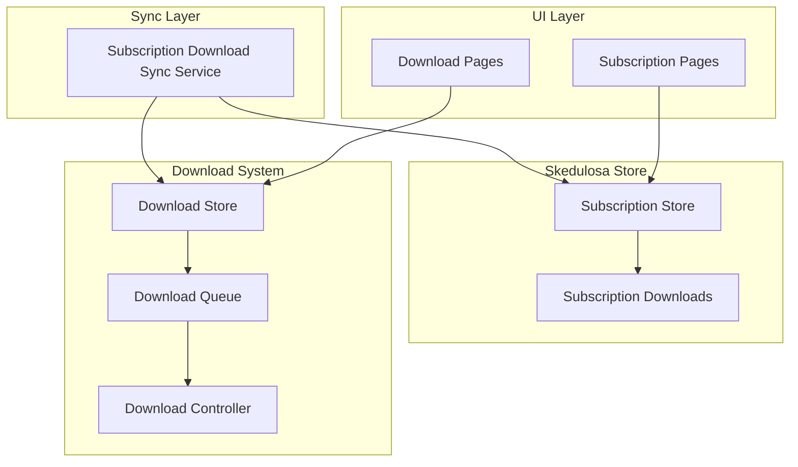
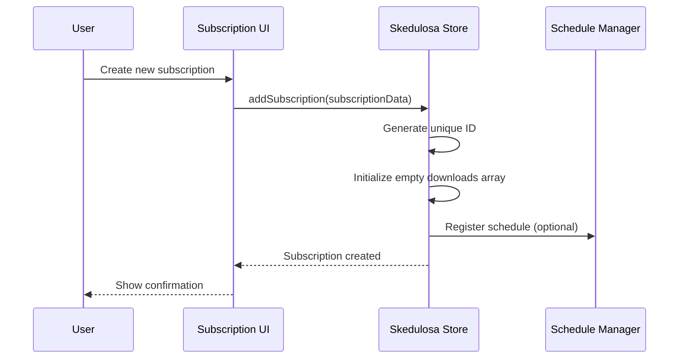
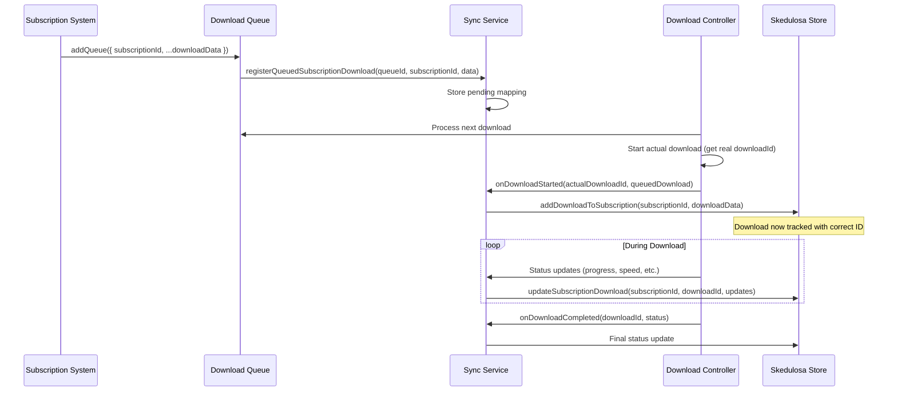
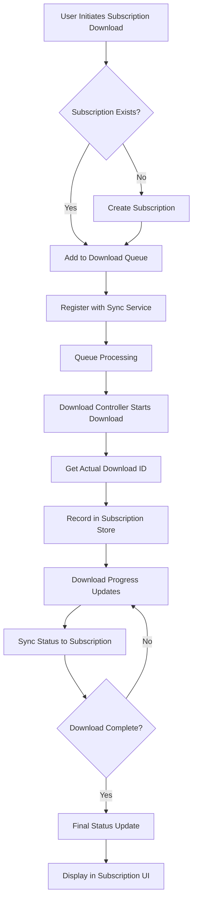
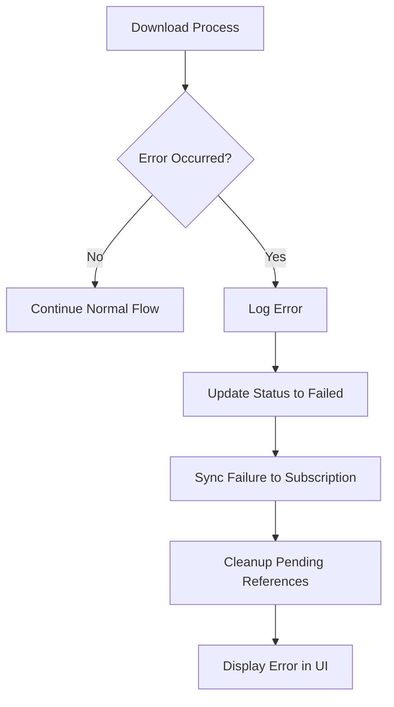

# Subscription Download System Documentation

## Table of Contents
1. [Quick Reference: Flow from Modal → Subscription Download → Monitoring](#quick-reference-flow-from-modal--subscription-download--monitoring)
2. [System Overview](#system-overview)
3. [Architecture Components](#architecture-components)
4. [Subscription Creation Flow](#subscription-creation-flow)
5. [Download Tracking Process](#download-tracking-process)
6. [Data Flow Diagrams](#data-flow-diagrams)
7. [Code Structure](#code-structure)
8. [Current Limitations](#current-limitations)
9. [Improvement Recommendations](#improvement-recommendations)
10. [Implementation Roadmap](#implementation-roadmap)

---

## Quick Reference: Flow from Modal → Subscription Download → Monitoring

This section answers: **How does the flow start from SkedulosaSubscribeModal? What do I do to make a download a subscription download? How do I monitor it?**

### 1. Flow starting from `SkedulosaSubscribeModal.tsx`

```mermaid
sequenceDiagram
    participant User
    participant Modal as SkedulosaSubscribeModal
    participant Store as Skedulosa Store
    
    User->>Modal: Opens modal, fills Channel Name + Source URL + schedule
    User->>Modal: Clicks "Subscribe"
    Modal->>Modal: handleSubscribe() – validate name + url
    Modal->>Modal: Build ScheduledChannel (channelId, channelName, channelUrl, schedule, status)
    Modal->>Store: addScheduledChannel(channel)
    Store->>Store: channelToSubscription(channel) → Subscription
    Store->>Store: addSubscription(subscription)
    Note over Store: Subscription.id = channel.channelId (UUID)
    Store->>Store: subscriptions[] updated; scheduledChannels[] synced
    Modal->>User: onClose(); optionally navigate to /skedulosa/subscription
```

**What actually happens:**

| Step | Where | What |
|------|--------|------|
| 1 | **SkedulosaSubscribeModal** | User enters **Channel Name** and **Source URL** (e.g. YouTube channel URL), plus schedule (days, time, quality, save path). |
| 2 | **handleSubscribe** | Builds a **Subscription** directly: `id`, `source`, **`sourceUrl`**, `schedule_time`, `settings`, `status: 'Active'`. |
| 3 | **addSubscription(subscription)** | Store adds the subscription; `scheduledChannels[]` stays in sync for backward compatibility. |
| 4 | **Subscription created** | Subscription has `source`, **`sourceUrl`**, `schedule_time`, `settings`, and **empty `downloads` array**. Use **`subscription.sourceUrl`** for "Check now" or scheduler. |

**Important:** The **source URL** is stored on `ScheduledChannel.channelUrl`. The `Subscription` type does not have a `sourceUrl` field; it only has `source` (display name). The store keeps both: `subscriptions[]` (new model) and `scheduledChannels[]` (legacy, derived from subscriptions). To “check” a subscription (fetch new content), you need the URL—use `getScheduledChannel(subscriptionId)` and read `channelUrl`, or extend `Subscription` to include a source URL.

---

### 2. How to make a download a “subscription download” for a specific subscription

A download is considered a **subscription download** for a given subscription **only if** when it is added to the queue you pass that subscription’s ID as **`subscriptionId`**.

**Rule:**  
**Wherever you call `addQueue(...)`, pass `subscriptionId: theSubscription.id` and the download will be tracked under that subscription.**

**Current call sites:**

| Call site | Passes `subscriptionId`? | Result |
|-----------|---------------------------|--------|
| **DownloadButton** (Status page, etc.) | No (optional prop, not set) | Regular download, not tracked under any subscription. |
| **Taskbar** (add from for-downloads) | No | Regular download. |
| **DownloadContextMenu** | No | Regular download. |
| **pluginAPI** (e.g. queue from plugin) | No | Regular download. |

So today, **no UI or plugin passes `subscriptionId`**. To get subscription downloads you must add that in one of these ways:

#### Option A: “Check now” / “Download for this subscription” in Skedulosa UI

- On a subscription detail view (e.g. **SelectedSubscriptionView** or a “Subscription downloads” / settings view), add a button like **“Check now”** or **“Download latest”**.
- When the user clicks it:
  1. Resolve the subscription’s **source URL** (e.g. from `getScheduledChannel(subscriptionId)?.channelUrl` or from a new `Subscription.sourceUrl` if you add it).
  2. Fetch or resolve the list of videos to download (e.g. via your existing metadata/plugin APIs).
  3. For **each** video you want to download, call **`addQueue({ subscriptionId: subscription.id, ...restOfPayload })`** with the same `subscriptionId` for that subscription.

Then the existing pipeline (queue → controller → sync service) will record each of those downloads under that subscription.

#### Option B: Scheduler / background job

- A scheduled job runs (e.g. by schedule time per subscription).
- For each subscription due to run:
  1. Get subscription and use **`subscription.sourceUrl`** to fetch new content.
  2. For each new video, call **`addQueue({ subscriptionId: subscription.id, ... })`**.

Again, using **`subscriptionId`** is what makes the download a subscription download.

#### Option C: Use DownloadButton with `subscriptionId` when the download is “for” a subscription

- If you have a list of items (e.g. “videos to download for this subscription”) and you use **DownloadButton**, pass the subscription id:

```tsx
<DownloadButton
  download={downloadPayload}
  subscriptionId={selectedSubscription.id}
/>
```

- That way, when the user clicks download, `addQueue` is called with `subscriptionId`, and the download is tracked under that subscription.

**Summary:**  
**To make a download a subscription download for a specific subscription:**  
Always pass **`subscriptionId: thatSubscription.id`** in the **`addQueue`** payload (or via DownloadButton’s `subscriptionId` prop). No other change is required; the rest of the flow (queue → controller → sync → Skedulosa store) is already in place.

---

### 3. What happens after you pass `subscriptionId`

Once `addQueue({ subscriptionId, ... })` is called:

1. **queueActions.addQueue**  
   - Pushes the item into `queuedDownloads` with `subscriptionId` set.  
   - If `subscriptionId` is present, calls **`subscriptionDownloadSync.registerQueuedSubscriptionDownload(queueId, subscriptionId, { name, displayName, ... })`** so the sync service can match the queue item to the subscription when the download starts.

2. **DownloadController**  
   - When it’s time, it takes the next queued item and starts the real download (gets the **actual download ID** from the engine).

3. **subscriptionDownloadSync.onDownloadStarted(actualDownloadId, queuedDownload)**  
   - Called from the controller with the **real** download ID and the queued item (which has `subscriptionId`).  
   - Sync service then calls **`addDownloadToSubscription(subscriptionId, { id: actualDownloadId, name, status: 'downloading', ... })`** so the Skedulosa store has the download under that subscription with the **correct** download ID.

4. **Lifecycle updates**  
   - As the download progresses or completes, **lifecycleActions** (and completion handling) call **`subscriptionDownloadSync.syncDownloadStatus`** / **`onDownloadCompleted`**, so the same download in the Skedulosa store gets status/speed updates and final status (e.g. completed/failed).

So: **one cohesive flow** from “add to queue with subscriptionId” → “track under subscription with real download ID” → “update status in subscription’s download list”.

---

### 4. How to monitor subscription downloads

- **Page:** **`SkedulosaSubscriptionDownloadsPage`**  
  - Route: under Skedulosa (e.g. `/skedulosa/subscription-downloads` or similar; check your router).

- **What it shows:**  
  - List of **subscriptions** (from `useSkedulosaStore((s) => s.subscriptions)`).  
  - For the selected subscription, a table of **downloads** (`subscription.downloads`) with name, status, size, speed, date added, and ID.

- **Data source:**  
  - The same **Skedulosa store** that was updated by **`addDownloadToSubscription`** and **`updateSubscriptionDownload`** when you passed `subscriptionId` and the sync service ran.

So: **create subscription in modal → add downloads with `subscriptionId` → they appear and update in real time on SkedulosaSubscriptionDownloadsPage.**

---

### 5. Checklist: “I created a subscription in the modal; how do I see downloads under it?”

1. **Create the subscription**  
   - Use **SkedulosaSubscribeModal** (Channel Name + Source URL + schedule) → **Subscribe**.  
   - Subscription exists with a unique `id` (and optional legacy `scheduledChannels` entry).

2. **Trigger subscription downloads**  
   - Somewhere (e.g. “Check now” on subscription view, or a scheduler), call **`addQueue({ subscriptionId: subscription.id, videoUrl, name, ... })`** (or use **DownloadButton** with **`subscriptionId={subscription.id}`** for each video).  
   - Ensure the subscription’s **source URL** is available (e.g. from `getScheduledChannel(id)?.channelUrl` or by adding `sourceUrl` to the Subscription model).

3. **Monitor**  
   - Open **Skedulosa Subscription Downloads** page.  
   - Select the subscription; its `downloads` list shows status/size/speed and stays in sync with the download store.

If no downloads appear, the most likely cause is that **no caller is passing `subscriptionId`** when queueing (e.g. no “Check now” or scheduler implemented yet).

---

## System Overview

The Subscription Download System is designed to track and manage downloads that are initiated by scheduled subscriptions. It maintains a separate tracking layer in the Skedulosa store while leveraging the existing download infrastructure in the Download store.

### Key Principles
- **Dual Store Architecture**: Downloads are managed by the Download store, tracked by the Skedulosa store
- **ID Synchronization**: Ensures subscription downloads use actual download IDs, not queue IDs
- **Real-time Updates**: Status changes flow from download operations to subscription tracking
- **Non-intrusive Design**: Subscription tracking doesn't interfere with normal download operations

## Architecture Components

### Core Components



### File Structure
```
src/
├── skedulosa/
│   ├── store/
│   │   └── skedulosaStore.tsx           # Subscription and download tracking
│   ├── services/
│   │   └── subscriptionDownloadSync.ts  # Synchronization service
│   ├── pages/
│   │   └── SkedulosaSubscriptionDownloadsPage.tsx  # UI for viewing tracked downloads
│   └── utils/
│       └── scheduleManagerUtils.ts      # Utility functions
├── downlodr/
│   ├── store/
│   │   ├── downloadStore.tsx            # Main download management
│   │   ├── download/
│   │   │   ├── controller.ts            # Download processing
│   │   │   ├── actions/
│   │   │   │   ├── queueActions.ts      # Queue management
│   │   │   │   └── lifecycleActions.ts  # Status updates
│   │   │   ├── types.ts                 # Type definitions
│   │   │   └── downloadPayloads.ts      # Data structures
│   │   └── downloadStore.tsx            # Store re-exports
│   └── components/
│       └── download/
│           └── DownloadButton.tsx       # Download initiation UI
```

## Subscription Creation Flow

### 1. Subscription Entity Structure

```typescript
interface Subscription {
  id: string;                    // Unique subscription identifier
  downloads: Download[];         // Tracked downloads for this subscription
  schedule_time: ScheduleTime[]; // When to check for new content
  last_checked_time: string;     // Last execution timestamp
  source: string;                // Content source (e.g., "youtube")
  recurring: boolean;            // Whether subscription repeats
  status: string;                // "Active", "Paused", "Error", etc.
  date_created: string;          // Creation timestamp
  upload_cadence: string;        // Expected content frequency
  settings: SubscriptionSettings[]; // Download preferences
}
```

### 2. Creation Process



### 3. Current Creation Methods

#### Manual Creation (Dummy Data)
```typescript
// From generateDummySubscription.ts
const subscription = generateDummySubscription();
addSubscription(subscription);
```

#### Programmatic Creation
```typescript
// Direct store interaction
const newSubscription: Subscription = {
  id: generateId(),
  downloads: [],
  schedule_time: [{ day: 'Monday' }],
  source: 'youtube',
  status: 'Active',
  // ... other fields
};
useSkedulosaStore.getState().addSubscription(newSubscription);
```

## Download Tracking Process

### 1. Download Entity Structure

```typescript
// In Skedulosa Store
interface Download {
  id: string;                 // Matches actual download ID
  status: string;             // Current download state
  name: string;               // Display name
  thumbnail_location: string; // Thumbnail URL/path
  size: string;               // File size
  speed: string;              // Download speed
  date_added: string;         // When added to subscription
}

// In Download Store
interface QueuedDownload extends BaseDownload {
  subscriptionId?: string;    // Links to subscription
  // ... all other download fields
}
```

### 2. Tracking Lifecycle



### 3. Key Integration Points

#### A. Queue Registration
```typescript
// In queueActions.ts
addQueue: (payload: AddQueuePayload) => {
  const queueId = uuidv4();
  
  // Add to download queue
  set((state) => ({
    queuedDownloads: [...state.queuedDownloads, {
      subscriptionId: payload.subscriptionId, // Key link
      id: queueId,
      // ... other fields
    }]
  }));
  
  // Register with sync service if subscription download
  if (subscriptionId) {
    subscriptionDownloadSync.registerQueuedSubscriptionDownload(
      queueId,
      subscriptionId,
      { name, displayName, thumbnails, size, speed }
    );
  }
}
```

#### B. Download Start Synchronization
```typescript
// In controller.ts
private async startDownloadDirectly(download: QueuedDownload): Promise<void> {
  // Start actual download process
  const downloadId = window.ytdlp.download(/* ... */);
  
  // Notify sync service with real download ID
  if (download.subscriptionId) {
    subscriptionDownloadSync.onDownloadStarted(downloadId, download);
  }
  
  // Continue with normal download setup...
}
```

#### C. Status Synchronization
```typescript
// In lifecycleActions.ts
updateDownload: (id: string, result: UpdateDownloadResult) => {
  // Update download store state
  set((state) => ({
    downloading: state.downloading.map((downloading) => {
      // ... update logic
      
      // Sync to subscription store if meaningful changes
      if (Object.keys(updates).length > 0 && 
          (updates.status || updates.speed || updates.progress !== undefined)) {
        subscriptionDownloadSync.syncDownloadStatus(id, {
          status: updates.status,
          speed: updates.speed,
          progress: updates.progress,
        });
      }
      
      return updatedDownload;
    })
  }));
}
```

## Data Flow Diagrams

### Complete System Flow



### Error Handling Flow



## Code Structure

### 1. Sync Service Architecture

```typescript
export class SubscriptionDownloadSyncService {
  // Singleton pattern for global coordination
  private static instance: SubscriptionDownloadSyncService;
  
  // Temporary storage for queue-to-download ID mapping
  private pendingSubscriptionDownloads = new Map<string, SubscriptionDownloadData>();
  
  // Core methods:
  registerQueuedSubscriptionDownload()  // Step 1: Queue registration
  onDownloadStarted()                   // Step 2: Actual download start
  syncDownloadStatus()                  // Step 3: Ongoing updates
  onDownloadCompleted()                 // Step 4: Completion handling
  cleanup()                             // Maintenance
  getDebugInfo()                        // Debugging support
}
```

### 2. Store Integration Points

#### Skedulosa Store Methods
```typescript
interface SkedulosaStoreState {
  // Core data
  subscriptions: Subscription[];
  
  // Subscription management
  addSubscription: (subscription: Subscription) => void;
  updateSubscription: (id: string, subscription: Subscription) => void;
  getSubscription: (id: string) => Subscription | undefined;
  
  // Download tracking (key methods)
  addDownloadToSubscription: (subscriptionId: string, input: SubscriptionDownloadInput) => void;
  updateSubscriptionDownload: (subscriptionId: string, downloadId: string, updates: Partial<Download>) => void;
}
```

#### Download Store Integration
```typescript
interface AddQueuePayload {
  subscriptionId?: string;  // Key field linking to subscription
  // ... all other download fields
}

interface QueuedDownload extends BaseDownload {
  subscriptionId?: string;  // Inherited from BaseDownload
  // ... other fields
}
```

### 3. UI Components

#### Subscription Downloads Page
```typescript
export default function SkedulosaSubscriptionDownloadsPage() {
  // State management
  const subscriptions = useSkedulosaStore((s) => s.subscriptions);
  const [selectedId, setSelectedId] = useState<string | null>(null);
  
  // Debug capabilities
  const debugInfo = subscriptionDownloadSync.getDebugInfo();
  
  // Testing utilities
  const testSubscriptionDownload = useCallback(() => {
    // Creates test downloads with proper subscription linking
  }, []);
  
  // Renders:
  // - Subscription selector
  // - Download table with status badges
  // - Debug information panel
  // - Test controls
}
```

## Current Limitations

### 1. Subscription Creation Gaps
- **Manual Process**: No automated subscription creation from UI
- **Limited Sources**: Only supports basic source types
- **No Validation**: Minimal input validation for subscription data
- **No Scheduling UI**: Schedule configuration is programmatic only

### 2. Download Integration Issues
- **One-way Sync**: Changes in subscription store don't affect download store
- **Limited Metadata**: Only basic download information is tracked
- **No Bulk Operations**: Can't manage multiple subscription downloads at once
- **Memory Leaks**: Pending downloads map could grow without cleanup

### 3. UI/UX Limitations
- **Basic Interface**: Limited filtering and sorting options
- **No Real-time Updates**: UI doesn't automatically refresh with download progress
- **Poor Error Handling**: Limited error display and recovery options
- **No Batch Actions**: Can't perform operations on multiple downloads

### 4. System Architecture Issues
- **Tight Coupling**: Sync service directly accesses store state
- **No Persistence**: Pending downloads are lost on app restart
- **Limited Scalability**: Singleton pattern may not scale well
- **No Event System**: Relies on direct method calls instead of events

## Improvement Recommendations

### Phase 1: Foundation Improvements (1-2 weeks)

#### 1.1 Enhanced Subscription Creation
```typescript
// Proposed: Subscription Creation Wizard
interface SubscriptionCreationWizard {
  steps: [
    'source-selection',    // Choose platform (YouTube, etc.)
    'content-selection',   // Channel/playlist selection
    'schedule-setup',      // When to check for new content
    'download-preferences', // Quality, location, etc.
    'confirmation'         // Review and create
  ];
}

// Implementation:
// - Create multi-step form component
// - Add source validation and preview
// - Implement schedule picker UI
// - Add subscription templates for common use cases
```

#### 1.2 Robust Error Handling
```typescript
// Proposed: Error Management System
interface SubscriptionError {
  id: string;
  subscriptionId: string;
  downloadId?: string;
  type: 'network' | 'permission' | 'format' | 'storage';
  message: string;
  timestamp: string;
  resolved: boolean;
  retryCount: number;
}

// Implementation:
// - Add error tracking to stores
// - Create error recovery mechanisms
// - Implement retry logic with exponential backoff
// - Add error notification system
```

#### 1.3 Real-time UI Updates
```typescript
// Proposed: WebSocket/EventEmitter Integration
class SubscriptionEventManager {
  private eventEmitter = new EventEmitter();
  
  // Events:
  // - subscription-created
  // - download-started
  // - download-progress
  // - download-completed
  // - download-failed
  
  subscribe(event: string, callback: Function): void;
  emit(event: string, data: any): void;
  unsubscribe(event: string, callback: Function): void;
}
```

### Phase 2: Advanced Features (2-3 weeks)

#### 2.1 Smart Scheduling System
```typescript
// Proposed: Advanced Scheduler
interface SmartScheduler {
  // AI-powered scheduling based on upload patterns
  analyzeUploadPattern(channelId: string): UploadPattern;
  
  // Adaptive scheduling that learns from content frequency
  adjustScheduleBasedOnActivity(subscriptionId: string): void;
  
  // Batch processing for efficiency
  scheduleBatchCheck(subscriptions: Subscription[]): void;
  
  // Priority-based downloading
  prioritizeDownloads(downloads: QueuedDownload[]): QueuedDownload[];
}
```

#### 2.2 Content Intelligence
```typescript
// Proposed: Content Analysis
interface ContentAnalyzer {
  // Duplicate detection
  detectDuplicates(newContent: ContentItem, existing: ContentItem[]): boolean;
  
  // Quality assessment
  assessContentQuality(content: ContentItem): QualityScore;
  
  // Content categorization
  categorizeContent(content: ContentItem): Category[];
  
  // Relevance scoring based on user preferences
  scoreRelevance(content: ContentItem, preferences: UserPreferences): number;
}
```

#### 2.3 Advanced UI Components
```typescript
// Proposed: Enhanced UI Features
interface AdvancedSubscriptionUI {
  // Real-time dashboard
  dashboard: {
    activeDownloads: number;
    queuedDownloads: number;
    completedToday: number;
    storageUsed: string;
    estimatedTimeRemaining: string;
  };
  
  // Filtering and search
  filters: {
    byStatus: StatusFilter[];
    bySource: SourceFilter[];
    byDateRange: DateRangeFilter;
    bySize: SizeFilter;
  };
  
  // Bulk operations
  bulkActions: {
    pauseSelected(): void;
    resumeSelected(): void;
    deleteSelected(): void;
    changeQuality(downloads: string[], quality: string): void;
  };
}
```

### Phase 3: System Architecture Overhaul (3-4 weeks)

#### 3.1 Event-Driven Architecture
```typescript
// Proposed: Event System
interface SubscriptionEventSystem {
  // Domain events
  events: {
    SubscriptionCreated: { subscriptionId: string; data: Subscription };
    DownloadQueued: { downloadId: string; subscriptionId: string };
    DownloadStarted: { downloadId: string; subscriptionId: string };
    DownloadProgressUpdated: { downloadId: string; progress: number };
    DownloadCompleted: { downloadId: string; status: 'success' | 'failed' };
  };
  
  // Event handlers
  handlers: Map<string, EventHandler[]>;
  
  // Methods
  publish<T>(event: string, data: T): void;
  subscribe(event: string, handler: EventHandler): void;
  unsubscribe(event: string, handler: EventHandler): void;
}
```

#### 3.2 Microservice Architecture
```typescript
// Proposed: Service Separation
interface SubscriptionServices {
  subscriptionManager: {
    create(data: SubscriptionInput): Promise<Subscription>;
    update(id: string, data: Partial<Subscription>): Promise<void>;
    delete(id: string): Promise<void>;
    list(filters?: SubscriptionFilters): Promise<Subscription[]>;
  };
  
  downloadTracker: {
    track(subscriptionId: string, downloadId: string): Promise<void>;
    updateStatus(downloadId: string, status: DownloadStatus): Promise<void>;
    getHistory(subscriptionId: string): Promise<Download[]>;
  };
  
  scheduler: {
    schedule(subscription: Subscription): Promise<void>;
    reschedule(subscriptionId: string, schedule: ScheduleTime[]): Promise<void>;
    pause(subscriptionId: string): Promise<void>;
    resume(subscriptionId: string): Promise<void>;
  };
  
  contentFetcher: {
    checkForNewContent(subscription: Subscription): Promise<ContentItem[]>;
    fetchMetadata(url: string): Promise<ContentMetadata>;
    validateSource(url: string): Promise<boolean>;
  };
}
```

#### 3.3 Data Persistence Layer
```typescript
// Proposed: Database Integration
interface SubscriptionDatabase {
  // Tables/Collections
  subscriptions: SubscriptionEntity[];
  downloads: DownloadEntity[];
  schedules: ScheduleEntity[];
  errors: ErrorEntity[];
  
  // Repositories
  subscriptionRepo: Repository<SubscriptionEntity>;
  downloadRepo: Repository<DownloadEntity>;
  scheduleRepo: Repository<ScheduleEntity>;
  
  // Migrations
  migrations: Migration[];
  
  // Backup/Restore
  backup(): Promise<BackupData>;
  restore(data: BackupData): Promise<void>;
}
```

### Phase 4: Performance & Scalability (2-3 weeks)

#### 4.1 Caching Strategy
```typescript
// Proposed: Multi-layer Caching
interface CachingSystem {
  // Memory cache for frequently accessed data
  memoryCache: Map<string, CacheEntry>;
  
  // Persistent cache for metadata
  persistentCache: IndexedDB | SQLite;
  
  // CDN integration for thumbnails and metadata
  cdnCache: CDNProvider;
  
  // Cache invalidation strategies
  invalidationRules: InvalidationRule[];
}
```

#### 4.2 Background Processing
```typescript
// Proposed: Worker System
interface BackgroundWorkers {
  // Content checking worker
  contentChecker: Worker;
  
  // Download processor
  downloadProcessor: Worker;
  
  // Cleanup worker
  cleanupWorker: Worker;
  
  // Analytics worker
  analyticsWorker: Worker;
}
```

#### 4.3 Monitoring & Analytics
```typescript
// Proposed: Observability
interface MonitoringSystem {
  metrics: {
    subscriptionCount: number;
    activeDownloads: number;
    successRate: number;
    averageDownloadTime: number;
    storageUsage: number;
  };
  
  alerts: {
    highFailureRate: Alert;
    storageAlmostFull: Alert;
    schedulerDown: Alert;
  };
  
  logs: {
    level: 'debug' | 'info' | 'warn' | 'error';
    destination: 'console' | 'file' | 'remote';
    retention: string;
  };
}
```

## Implementation Roadmap

### Week 1-2: Foundation
- [ ] Create subscription creation wizard UI
- [ ] Implement comprehensive error handling
- [ ] Add real-time UI updates with WebSocket/EventEmitter
- [ ] Create automated tests for sync service

### Week 3-4: Enhanced Features
- [ ] Build smart scheduling system
- [ ] Add content intelligence features
- [ ] Implement advanced filtering and search
- [ ] Create bulk operation capabilities

### Week 5-6: Architecture Improvements
- [ ] Refactor to event-driven architecture
- [ ] Separate concerns into microservices
- [ ] Add database persistence layer
- [ ] Implement backup/restore functionality

### Week 7-8: Performance & Polish
- [ ] Add multi-layer caching
- [ ] Implement background workers
- [ ] Create monitoring and analytics
- [ ] Performance optimization and testing

### Week 9-10: Testing & Documentation
- [ ] Comprehensive testing suite
- [ ] Performance benchmarking
- [ ] User documentation
- [ ] Developer API documentation

## Conclusion

The current subscription download system provides a solid foundation but has significant room for improvement. The proposed enhancements would transform it from a basic tracking system into a comprehensive, intelligent content management platform.

Key success metrics for improvements:
- **User Experience**: Reduced setup time, better error handling, real-time updates
- **Reliability**: Higher success rates, better error recovery, robust scheduling
- **Performance**: Faster processing, efficient resource usage, scalable architecture
- **Maintainability**: Clean code structure, comprehensive testing, good documentation

The phased approach ensures steady progress while maintaining system stability throughout the improvement process.